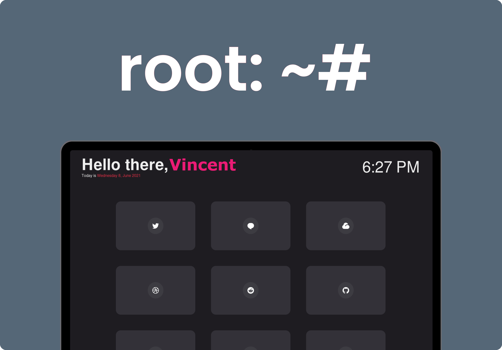

### Custom version
- added: Search input field (currently setup for DuckDuckGo)
- added: Custom Name in URL
- added: Custom Messages in URL
- added: Dark mode / Light mode
- Added: One Time popup to help the user

### Root is a start-page aimed to simplicity and elegance

This project is blazing fast :zap:, it only contains an html, css and javascript files.
This version of the project contains an searchbar for quick and easy online search actions

## Customizing

Root was created to be lightweight, fast and easy to customize.

### Changing Colors

To change the colors used in the startpage edit `styles.css`.

```css
:root {
  --primary: #eeeeee;
  --text-light: #FFC759
  --background: #002f6c;
  --background-light: #00408c;
}
```

### Changing displayed Name and Message
Add name value to URL
```html
?nameurl=Vincent
````
And for message add:
```html
&messageurl=Hello%20there
```
Example:
```html
https://www.examplesite.nl/index.html?nameurl=Vincent&messageurl=Hello there
```

### Adding Custom Cards

> This project uses [Remix Icons](https://remixicon.com/).

To change the default name and edit the cards, edit `app.js`. It should look something like this:

```js
const CARDS = [
  {
    name: "Twitter",
    icon: "ri-twitter-fill",
    link: "https://twitter.com",
  },
  {
    name: "Github",
    icon: "ri-github-fill",
    link: "https://github.com/",
  },
];
```

To add a new card, just append a new object to the `CARDS` constant. The object should look something like this:

```js
{
  name: "<Webpage Name>",
  icon: "<Icon Class-Name>",
  link: "<Webpage Link>"
},
```

> To get the icon class-name, just go to [Remix Icons](https://remixicon.com/), select the desired icon. You should see something like this: `<i class="this-is-the-class-name"></i>`.

To use 24 hour time simply change the time section of `app.js` to
```
// Update the Time
  currentTime.innerHTML = `${currentHour}:${currentMinute}`;
```

### Changin search engine in search bar

For change to Google update index.html, default is DuckDuckGo
```html
  		<form id="searchbar" method="get" action="https://google.com/?q=q" autocomplete="off">
```


### Change colors for dark-mode

Edit the CSS file after 'prefers-color-scheme: dark'
```html
    @media (prefers-color-scheme: dark) {
    /* Voeg hier de CSS code die je wilt gebruiken om je website een Dark Mode te geven */
      :root {
      --primary: #FFC759;
      --text-light: #eeeeee;
      --background: #191E29;
      --background-light: #202633;
      }
    }
```

